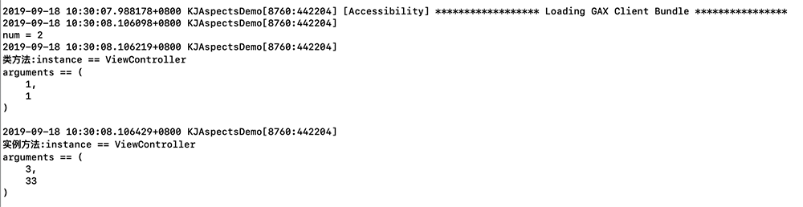

# KJAspectsDemo
AOP(面向切面编程) 相关的一款 Aspects 封装工具  
<p align="left">
  
</p>

----------------------------------------
### 框架整体介绍
* [作者信息](#作者信息)
* [作者其他库](#作者其他库)
* [使用方法](#使用方法)

#### <a id="作者信息"></a>作者信息
> Github地址：https://github.com/yangKJ  
> 简书地址：https://www.jianshu.com/u/c84c00476ab6  
> 博客地址：https://blog.csdn.net/qq_34534179  

#### <a id="作者其他库"></a>作者其他Pod库
```
播放器 - KJPlayer是一款视频播放器，AVPlayer的封装，继承UIView
pod 'KJPlayer'  # 播放器功能区
pod 'KJPlayer/KJPlayerView'  # 自带展示界面

实用又方便的Category和一些自定义控件
pod 'KJEmitterView'
pod 'KJEmitterView/Function'#
pod 'KJEmitterView/Control' # 自定义控件

轮播图 - 支持缩放 多种pagecontrol 支持继承自定义样式 自带网络加载和缓存
pod 'KJBannerView'  # 轮播图，网络图片加载

菜单控件 - 下拉控件 选择控件
pod 'KJMenuView' # 菜单控件

加载Loading - 多种样式供选择
pod 'KJLoadingAnimation' # 加载控件

```

##### Issue
如果您在使用中有好的需求及建议，或者遇到什么bug，欢迎随时issue，我会及时的回复，有空也会不断优化更新这些库

#### <a id="使用方法"></a>使用方法
```
/// AOP
- (void)kj_AopAspects{
    [KJAspectsTool kj_AspectsWithClassName:@"ViewController" Selector:@selector(testWithA:B:) Options:(KJAspectPositionAfter) UsingBlock:^(KJAspectsTool * _Nonnull info, NSError * _Nonnull error) {
        NSLog(@"\n类方法:instance == %@\narguments == %@\n", NSStringFromClass([info.kj_instance class]),info.kj_arguments);
    }];
    [ViewController testWithA:@"1" B:1];

    ViewController *vc = [ViewController new];
    [KJAspectsTool kj_AspectsWithMetalClass:vc Selector:@selector(xxxxWithA:B:) Options:(KJAspectPositionInstead) UsingBlock:^(KJAspectsTool * _Nonnull info, NSError * _Nonnull error) {
        NSLog(@"\n实例方法:instance == %@\narguments == %@", NSStringFromClass([info.kj_instance class]),info.kj_arguments);
    }];
    /// 调用私有方法
    [vc performSelector:@selector(xxxxWithA:B:) withObject:@"3" withObject:@"33"];
    // objc_msgSend(vc, @selector(xxxxWithA:B:), @"1", @"2");
}
```
### 对应的ViewController

```
//
//  ViewController.h
//  KJAspectsDemo
//
//  Created by 杨科军 on 2019/9/10.
//  Copyright © 2019 杨科军. All rights reserved.
//

#import <UIKit/UIKit.h>
#import <objc/message.h>
@interface ViewController : UIViewController

+ (NSInteger)testWithA:(NSString*)a B:(NSInteger)b;
//- (void)xxxxWithA:(NSString*)a B:(NSString*)b;

@end


//
//  ViewController.m
//  KJAspectsDemo
//
//  Created by 杨科军 on 2019/9/10.
//  Copyright © 2019 杨科军. All rights reserved.
//

#import "ViewController.h"

@implementation ViewController

- (void)viewDidLoad {
    [super viewDidLoad];
    // Do any additional setup after loading the view.
}

+ (NSInteger)testWithA:(NSString*)a B:(NSInteger)b{
    NSInteger i = [a integerValue] + b;
    NSLog(@"\nnum = %ld",i);
    return i;
}

- (void)xxxxWithA:(NSString*)a B:(NSString*)b{
    NSLog(@"\n-----实例方法:%@  %@",a,b);
}

@end

```